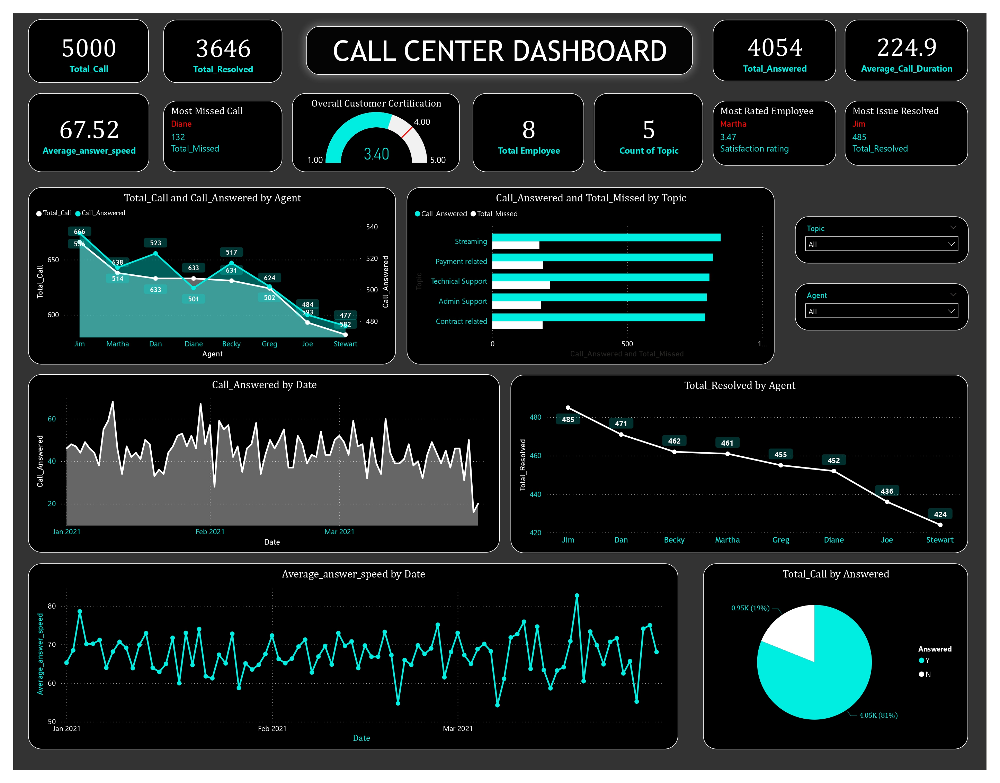

# 📊 Call Center Dashboard

This project provides an **interactive Call Center Dashboard** to monitor and analyze call center performance metrics.  
It helps management track **call volumes, agent performance, issue resolution, and customer satisfaction** in real time.

---

## 🚀 Features
- 📞 **Total Calls, Answered, and Resolved** tracking
- ⏱ **Average Answer Speed** and **Average Call Duration**
- 👥 **Agent-wise performance** (calls handled, resolved, missed)
- 📌 **Topic-wise distribution** of calls (Streaming, Payment, Support, etc.)
- ⭐ **Top-rated employees** and **issue resolution leaders**
- 📈 **Trends over time**: calls answered, resolution rate, and response speed
- 🥧 **Call distribution pie chart** (answered vs. missed)

---

## 📷 Dashboard Preview

---

## 🛠 Tech Stack
- **Power BI / Tableau / Python (Matplotlib, Pandas)** for visualization *(based on your implementation)*
- **SQL Server / MariaDB / MongoDB** for data storage
- **API integrations** for real-time data collection

---

## 📊 Key Insights
- **5000 total calls** received in the period
- **3646 resolved** (72.9% resolution rate)
- **Jim** resolved the most issues (485)
- **Martha** received the highest customer satisfaction rating (3.47/5)
- **Diane** had the most missed calls (132)
- **Average Answer Speed:** 67.52 seconds
- **Average Call Duration:** 224.9 seconds

---

## 📂 Project Structure
